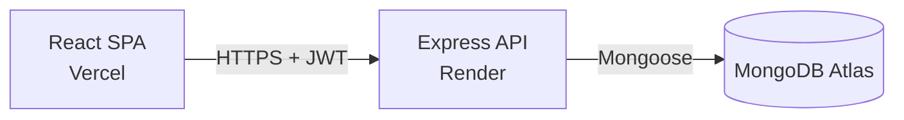

# Penta — Financial Analytics Dashboard

**Live:** https://financial-analytics-dashboard-chi-gold.vercel.app/

## What this is

A full-stack financial dashboard built for a college assignment: JWT login, a dashboard with
charts and summary metrics, a searchable/filterable/sortable transaction table, and a
configurable CSV export. Dark mode by default, with a light mode toggle.

## Tech stack

- **Frontend:** React + TypeScript (Vite), Chakra UI, Recharts, TanStack Query
- **Backend:** Express + TypeScript, MongoDB (Mongoose), JWT auth
- **Docs:** Swagger UI, generated from JSDoc comments on the routes

```
backend/    Express API, Mongoose models, seed script
frontend/   Vite + React SPA
```

## System overview



The frontend never talks to the database directly — every request goes through the API,
which validates the JWT and does the actual querying.

## Setup

You need Node 18+ and a MongoDB instance — local `mongod`, Docker, or Atlas all work.

**Backend:**

```bash
cd backend
cp .env.example .env   # fill in your Mongo URI and JWT secret
npm install
npm run seed            # loads data/transactions.json and creates the login user
npm run dev              # http://localhost:5050
```

`MONGO_URI` and `JWT_SECRET` are required — no defaults — so a typo or a forgotten env var
fails loudly on startup instead of quietly connecting to the wrong thing.

| Variable | What it's for |
|---|---|
| `PORT` | API port, defaults to `5050` |
| `MONGO_URI` | Required. Local: `mongodb://127.0.0.1:27017/finance_dashboard`. Atlas: `mongodb+srv://<user>:<password>@<cluster-host>/finance_dashboard?appName=Cluster0` |
| `JWT_SECRET` | Required. `node -e "console.log(require('crypto').randomBytes(48).toString('hex'))"` |
| `JWT_EXPIRES_IN` | Token lifetime, defaults to `1d` |
| `CORS_ORIGIN` | Comma-separated allowed origins, e.g. `http://localhost:5173,https://financial-analytics-dashboard-chi-gold.vercel.app` |
| `SEED_ADMIN_USERNAME` / `SEED_ADMIN_PASSWORD` / `SEED_ADMIN_NAME` | The login account `npm run seed` creates |

Running `npm run seed` again is safe — it skips the login user if it already exists, but it
does wipe and reload the `transactions` collection every time from `data/transactions.json`.

The sample data only gives each row a `user_id`, no name or photo. The seed script maps the
4 user ids to display names and a [randomuser.me](https://randomuser.me) portrait, picked
deterministically from a hash of the name so the same user always gets the same face across
re-seeds. If that image ever fails to load, the UI falls back to a colored initials circle
instead of a broken image icon.

**Frontend**, in a second terminal:

```bash
cd frontend
cp .env.example .env
npm install
npm run dev              # http://localhost:5173
```

Log in with:

```
username: analyst
password: Analyst@123
```

## API overview

Everything's under `/api`, JWT-protected except login. Full request/response schemas, query
params, and try-it-out requests are at **`/api/docs`** (Swagger UI) once the backend is running.

- `POST /api/auth/login`, `GET /api/auth/me`, `POST /api/auth/logout`
- `GET /api/transactions` — paginated, filtered, sorted, searchable
- `GET /api/transactions/summary` — totals, category breakdown, monthly/yearly trend, recent transactions
- `GET /api/transactions/users` — for filter dropdowns
- `POST /api/transactions/export` — CSV, configurable columns

One rule worth knowing since it's not obvious from the endpoint alone: revenue, expenses,
balance, and savings on `/summary` only ever count **Paid** transactions. Pending ones still
show up in the transaction table and the recent-transactions list, they just don't move any
of the totals.

## Features

- JWT login/logout, protected API routes
- Dashboard: balance/revenue/expenses/savings cards, income-vs-expense chart, category
  breakdown, recent transactions (filterable by status, user, month, or year)
- Transaction table: search, filters (date, amount, category, status, user), sortable
  columns, pagination
- CSV export: pick columns, export the current filtered view or everything, downloads
  automatically
- Dark/light theme toggle, persisted across reloads
- Responsive layout, with loading/empty/error states throughout
