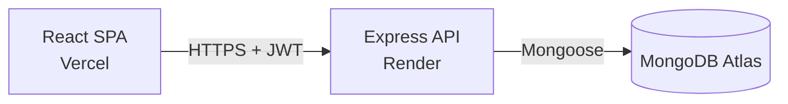
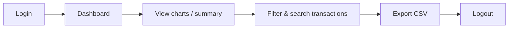

# Penta — Financial Analytics Dashboard

**Frontend:** https://financial-analytics-dashboard-chi-gold.vercel.app/
**Backend:** https://financial-analytics-dashboard-r2s9.onrender.com/api/health

Backend is on Render's free tier. First request after idle takes 30-50s to cold-start.

## What this is

A full-stack financial dashboard: JWT auth, a dashboard with charts and a filterable
transaction table, CSV/JSON export, and a second Analytics page with cashflow, month
comparison, and per-user breakdowns. Built against the assignment spec below — this README
says exactly which parts were required and which weren't.

## Tech stack

- **Frontend:** React 19 + TypeScript (Vite), React Router, Chakra UI, Recharts, TanStack
  Query, react-day-picker
- **Backend:** Express + TypeScript, MongoDB (Mongoose), JWT (jsonwebtoken + bcryptjs), Zod
  for request validation
- **Docs:** Swagger UI from JSDoc comments on the routes, plus a Postman collection

```
backend/    Express API, Mongoose models, seed script
frontend/   Vite + React SPA
postman_collection.json   Every endpoint, importable into Postman
```

## Diagrams

### System overview



The frontend never talks to the database directly — every request goes through the API,
which validates the JWT and does the actual querying.

### User flow



## Setup

Node 18+, and a MongoDB instance — local `mongod`, Docker, or Atlas.

**Backend:**

```bash
cd backend
cp .env.example .env   # fill in your Mongo URI and JWT secret
npm install
npm run seed            # loads data/transactions.json, creates the login user
npm run dev              # http://localhost:5050
```

`MONGO_URI` and `JWT_SECRET` have no defaults — a missing one crashes startup immediately
instead of connecting to the wrong thing silently.

| Variable | What it's for |
|---|---|
| `PORT` | API port, defaults to `5050` |
| `MONGO_URI` | Required. Local: `mongodb://127.0.0.1:27017/finance_dashboard`. Atlas: `mongodb+srv://<user>:<password>@<cluster-host>/finance_dashboard?appName=Cluster0` |
| `JWT_SECRET` | Required. `node -e "console.log(require('crypto').randomBytes(48).toString('hex'))"` |
| `JWT_EXPIRES_IN` | Token lifetime, defaults to `1d` |
| `CORS_ORIGIN` | Comma-separated allowed origins, e.g. `http://localhost:5173,https://your-app.vercel.app` |
| `SEED_ADMIN_USERNAME` / `SEED_ADMIN_PASSWORD` / `SEED_ADMIN_NAME` | The login account `npm run seed` creates |

`npm run seed` is safe to re-run — it skips the login user if it exists, but always wipes and
reloads the `transactions` collection from `data/transactions.json` (the assignment's sample
data, 300 rows, 4 users, all dated 2024).

The sample data only has a `user_id` per row, no name or photo. The seed script maps the 4
ids to display names and a deterministic [randomuser.me](https://randomuser.me) portrait —
same user, same face, every re-seed. If a portrait URL fails to load, Chakra's `Avatar` falls
back to initials on its own.

**Frontend**, second terminal:

```bash
cd frontend
cp .env.example .env
npm install
npm run dev              # http://localhost:5173
```

| Variable | What it's for |
|---|---|
| `VITE_API_BASE_URL` | Required, no fallback. Backend's `/api` root, e.g. `http://localhost:5050/api` |

Log in with:

```
username: analyst
password: Analyst@123
```

These are just the `SEED_ADMIN_*` defaults in `backend/.env.example` — change them before
seeding if you want a different account.

## Assignment scope

The brief (`full-stack assignment (1).pdf`) asked for: JWT login/logout with secured
endpoints, a dashboard with revenue-vs-expenses and category-breakdown charts and summary
metrics, a paginated transaction table with filters (date, amount, category, status, user),
sortable columns with visual indicators, real-time search, error handling via alert chips,
and a CSV export with a column-selection modal and auto-download. Backend: REST API,
MongoDB, JWT, CSV generation. Docs: README, API spec, correctly-headered CSV.

Everything on that list is built:

- **Auth** — JWT login/logout, `requireAuth` middleware validates the token on every
  protected route, invalid/expired tokens get a 401.
- **Dashboard charts** — revenue-vs-expenses line chart (Monthly/Yearly toggle), a category
  breakdown donut, and summary metric cards (Balance, Revenue, Expenses, Savings).
- **Transaction table** — paginated, sortable (click a column header, arrow icon shows
  direction), filterable by date range, amount range, category, status, and user, with a
  debounced live search box.
- **Alert chips** — `AlertChip` component, used on every widget that fetches data; a failed
  request shows an inline error in that widget, not a blank screen.
- **CSV export** — a modal for picking which columns to include and whether to export the
  current filtered view or everything; the file downloads automatically once generated.
- **Backend** — Express + TypeScript, Mongoose models, JWT auth, `csv-stringify` for
  generation, Zod validation on every route's query/body.
- **Docs** — this README, Swagger UI at `/api/docs` for endpoint specs, and CSV output has
  a real header row with configurable columns.

## Beyond scope

Not asked for, built anyway:

- **Analytics page** — a second route with its own KPI row (adds Avg. Transaction Value and
  Top Category), a cashflow chart, a month-over-month compare panel, a Paid-vs-Pending status
  donut alongside a Paid-only category donut, and a per-user summary section with its own
  paginated transaction list.
- **JSON export** — same export endpoint, `format: "json"` instead of `"csv"`, same column
  selection.
- **Date range picker with month/year dropdowns** — the brief just asked for a date filter;
  this one lets you jump to any month/year directly instead of clicking prev/next.
- **Dark/light theme toggle** — dark by default, every surface color is a token with both
  values, not just the page background.
- **Postman collection** — `postman_collection.json` at the repo root, every endpoint, a
  `token` variable the login request fills in automatically.
- **Sidebar navigation beyond the dashboard** — Wallet, Personal, Message, Settings are real
  routes with placeholder pages, not dead links.
- **Live deployment** — Vercel (frontend) + Render (backend) + MongoDB Atlas, not just
  something that runs on localhost.
- **Recent-transactions widget and a per-transaction detail drawer** on the dashboard,
  neither of which was asked for.

## API

Everything's under `/api`, JWT-protected except login and the health check. Full schemas at
**[`/api/docs`](https://financial-analytics-dashboard-r2s9.onrender.com/api/docs)** (Swagger UI). `postman_collection.json` has the same endpoints pre-built.

- `GET /api/health` — liveness check, no auth
- `POST /api/auth/login`, `GET /api/auth/me`, `POST /api/auth/logout`
- `GET /api/transactions` — paginated, filtered, sorted, searchable
- `GET /api/transactions/:id` — single transaction by Mongo id
- `GET /api/transactions/summary` — totals, category breakdown, yearly/monthly rollup, recent transactions
- `GET /api/transactions/summary/compare?periodA=YYYY-MM&periodB=YYYY-MM` — compare two months
- `GET /api/transactions/stats` — dataset counts, volume, breakdowns by status/category
- `GET /api/transactions/users` — for filter dropdowns
- `POST /api/transactions/export` — CSV or JSON (`format: "csv" | "json"`), configurable columns
- `GET /api/analytics/kpis` — revenue, expenses, balance, count, average value, top category
- `GET /api/analytics/cashflow` — revenue minus expenses per month, for a given year
- `GET /api/users/:id/summary` — one user's totals (`:id` is a `user_id` like `user_001`, not a login account)

**Conventions:**

- Vocabulary is fixed everywhere: `revenue` / `expenses`, never `income` or `totalRevenue`.
  Status in output is always exactly `Paid` or `Pending` — `completed` and other casings are
  accepted as input and normalized before they touch the database.
- Paid-only is the default on every aggregate endpoint (`/summary`, `/analytics/kpis`,
  `/analytics/cashflow`, `/transactions/stats`, `/summary/compare`). All of them accept
  `?status=Paid|Pending|all`, and the response echoes back which one was actually applied as
  `data.filter` — never ambiguous from the numbers alone. Pending transactions still show up
  in the transaction table and recent-transactions list; they just don't move a total unless
  you ask for them.
- No separate `savings` field in the API — it was always identical to balance once Pending
  stopped counting by default. The dashboard's Savings card still shows that value; a metric
  card and an API field aren't the same thing.
- Monthly figures live at `yearly[year].monthly`, keyed `"YYYY-MM"`.
- `/analytics/*`, `/users/:id/summary`, `/transactions/:id`, `/transactions/stats`, and
  `/summary/compare` wrap their payload as `{ data: {...} }`. `/transactions` and
  `/transactions/summary` keep their own shapes (`{ data, pagination }` and
  `{ summary, categoryBreakdown, yearly, recentTransactions }`).

## What's not here

No automated tests, in either package. No write endpoints — the API is read-only plus
CSV/JSON export; the only way transaction data changes is re-running the seed script. The
summary aggregation is cached in memory for 60 seconds (a `Map`, not Redis) since there's one
process and nothing else writes to the collection.
